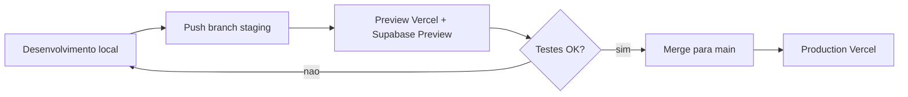

# Deploy na Vercel (GitHub + Supabase + staging)

Guia para publicar a **Plataforma Orienta** (`orienta-v1`) com URL publica, builds automaticos e ambiente de testes externos.

## Visao geral

| Ambiente Vercel | Branch Git | URL tipica | Uso |
|-----------------|------------|------------|-----|
| **Production** | `main` | `https://<projeto>.vercel.app` | homologacao externa “estavel” |
| **Preview (staging)** | `staging` | `https://<projeto>-git-staging-<team>.vercel.app` | testes antes de ir para `main` |
| **Preview (PR)** | qualquer PR | `https://<projeto>-git-<branch>-<team>.vercel.app` | revisao por feature |

O CI em [`.github/workflows/ci.yml`](../../.github/workflows/ci.yml) continua validando lint/test/build no GitHub. A Vercel dispara **outro** build ao fazer push (integracao Git).

## Pre-requisitos

1. Conta [GitHub](https://github.com) e [Vercel](https://vercel.com) (login com GitHub).
2. Projeto Supabase com migrations aplicadas (`supabase/migrations/`).
3. Node 20+ local (o build na Vercel usa Node 20 por padrao no Next.js).

## 1. Subir o codigo para o GitHub

Na raiz do monorepo (`PLATAFORMA ORIENTA`):

```powershell
cd "c:\Users\01647043450\Downloads\PLATAFORMA ORIENTA"
git init
git add .
git commit -m "chore: preparar monorepo para deploy Vercel"
```

Crie um repositorio vazio no GitHub (ex.: `plataforma-orienta`) e conecte:

```powershell
git branch -M main
git remote add origin https://github.com/<sua-org>/plataforma-orienta.git
git push -u origin main
```

Crie a branch de staging para testes:

```powershell
git checkout -b staging
git push -u origin staging
```

## 2. Importar o projeto na Vercel (integracao GitHub)

1. Acesse [vercel.com/new](https://vercel.com/new) → **Import Git Repository**.
2. Autorize o GitHub e selecione o repositorio.
3. Em **Configure Project**, use **uma** das opcoes abaixo (nao misture):

   **Opcao A (recomendada)** — Root Directory = `orienta-v1`:
   - **Root Directory**: `orienta-v1`
   - **Build / Install**: deixe o padrao (usa `orienta-v1/vercel.json`)

   **Opcao B** — Root Directory = `.` (raiz do repo):
   - Deixe a raiz vazia; o `vercel.json` na raiz do repositorio ja define `npm ci --prefix orienta-v1` e o build no subpacote.

   Se o log mostrar `next: command not found`, as dependencias nao foram instaladas em `orienta-v1` — confira a opcao acima.
4. **Environment Variables**: adicione as variaveis da secao 3 (pode colar depois do primeiro deploy falhar por falta de env).
5. Clique **Deploy**.

Apos o primeiro deploy, a Vercel gera um dominio publico temporario:

`https://<nome-do-projeto>.vercel.app`

Cada push em `main` atualiza **Production**. Push em `staging` ou abertura de PR gera **Preview** com URL propria.

### Builds automaticos

Em **Project → Settings → Git**:

- **Production Branch**: `main`
- **Preview Deployments**: Enabled (todas as outras branches e PRs)
- Opcional: **Ignored Build Step** vazio (build em todo push)

## 3. Variaveis de ambiente na Vercel

Referencia completa: [`.env.vercel.example`](../.env.vercel.example).

| Variavel | Production | Preview (staging) | Secreto |
|----------|------------|-------------------|---------|
| `NEXT_PUBLIC_SUPABASE_URL` | sim | sim | nao |
| `NEXT_PUBLIC_SUPABASE_ANON_KEY` | sim | sim | nao (anon/publishable) |
| `SUPABASE_SERVICE_ROLE_KEY` | sim | sim | **sim** |
| `NEXT_PUBLIC_APP_URL` | URL de Production | URL fixa da branch `staging` | nao |
| `NEXT_PUBLIC_DEFAULT_*` | opcional | recomendado para testes | nao |
| `ALLOW_DEV_PROFILE_FALLBACK` | **nao** | **nao** em testes externos | — |

### Como preencher `NEXT_PUBLIC_APP_URL`

1. Faca o primeiro deploy (mesmo sem todas as env) ou abra **Deployments**.
2. Copie a URL de **Production** (ex.: `https://plataforma-orienta.vercel.app`).
3. Em **Settings → Environment Variables**:
   - `NEXT_PUBLIC_APP_URL` → marque **Production** → cole a URL de producao.
4. Faca deploy da branch `staging` uma vez; copie a **Branch URL** (formato `https://<projeto>-git-staging-<team>.vercel.app`).
5. Crie outra entrada `NEXT_PUBLIC_APP_URL` com o mesmo nome, marque apenas **Preview**, valor = URL da branch staging.

A Vercel injeta `VERCEL_URL` / `VERCEL_BRANCH_URL` em runtime; o codigo em `src/lib/app-url.ts` usa isso como fallback quando `NEXT_PUBLIC_APP_URL` nao estiver definida, mas **links de e-mail do Supabase Auth** dependem de `NEXT_PUBLIC_APP_URL` ou do header `Origin` correto.

**Nunca** defina `ALLOW_DEV_PROFILE_FALLBACK=1` em Production ou Preview publicos.

## 4. Supabase (Auth + Storage + RLS)

No [Supabase Dashboard](https://supabase.com/dashboard) → seu projeto → **Authentication** → **URL Configuration**:

| Campo | Valor sugerido |
|-------|----------------|
| **Site URL** | URL de Production (`NEXT_PUBLIC_APP_URL` de prod) |
| **Redirect URLs** | Adicione todas as URLs abaixo (uma por linha) |

```
http://localhost:3000/**
https://<projeto>.vercel.app/**
https://<projeto>-git-staging-<team>.vercel.app/**
https://*-<team>.vercel.app/**
```

Substitua `<team>` pelo slug do time na Vercel (visivel na URL do dashboard). O padrao com curinga ajuda em previews de PR; em producao restritiva, liste apenas URLs conhecidas.

Rotas de callback usadas pelo app:

- `/auth/update-password` (recuperacao de senha)

**Storage**: confirme o bucket `evidencias` e policies (migration `0014` ou manual no Dashboard).

**CORS** (se usar upload direto do browser): em Storage → Settings, inclua o dominio `*.vercel.app` se necessario.

### Projeto Supabase separado para staging (opcional)

Para dados isolados de testes externos:

1. Duplique o projeto Supabase ou use [Supabase Branching](https://supabase.com/docs/guides/deployment/branching).
2. Na Vercel, escopo **Preview** → use URL/keys do projeto de staging.
3. Escopo **Production** → projeto principal.

## 5. Fluxo de trabalho recomendado



1. Desenvolva em `localhost:3000` com `.env.local`.
2. `git push origin staging` → testers acessam a URL Preview da branch.
3. Apos validacao, merge `staging` → `main` → deploy Production automatico.

## 6. Verificacao pos-deploy

Checklist:

- [ ] Abrir `/` e `/auth/forgot-password` na URL publica.
- [ ] Login com usuario real do Supabase Auth.
- [ ] Recuperacao de senha (e-mail com link apontando para o dominio correto).
- [ ] Upload de evidencia (Storage).
- [ ] Rotas `/api/dev/*` retornam **404/403** (bloqueadas fora de `NODE_ENV=development`).

Comandos locais (mesmos gates do CI):

```bash
cd orienta-v1
npm run lint
npm run test
npm run build
```

## 7. Dominio customizado (opcional)

**Project → Settings → Domains** → adicione `staging.seudominio.com` (Preview, branch `staging`) e `app.seudominio.com` (Production). Atualize `NEXT_PUBLIC_APP_URL` e as Redirect URLs no Supabase.

## 8. Solucao de problemas

| Sintoma | Acao |
|---------|------|
| Build falha “Missing NEXT_PUBLIC_SUPABASE_URL” | Preencher env na Vercel e **Redeploy**. |
| Login ok, reset de senha quebra | Conferir Redirect URLs e `NEXT_PUBLIC_APP_URL` do ambiente. |
| 401 nas APIs | Usar login Supabase (sessao cookie); em prod nao ha `x-user-id` de dev. |
| Upload evidencia falha | Bucket `evidencias` e `SUPABASE_SERVICE_ROLE_KEY` em Production/Preview. |
| Deploy da raiz errada | Root Directory deve ser `orienta-v1`. |

## Arquivos de configuracao no repositorio

- [`vercel.json`](../vercel.json) — install/build e regiao `gru1` (Sao Paulo).
- [`src/lib/app-url.ts`](../src/lib/app-url.ts) — resolucao de URL em runtime na Vercel.
- [`.env.vercel.example`](../.env.vercel.example) — modelo de variaveis.
