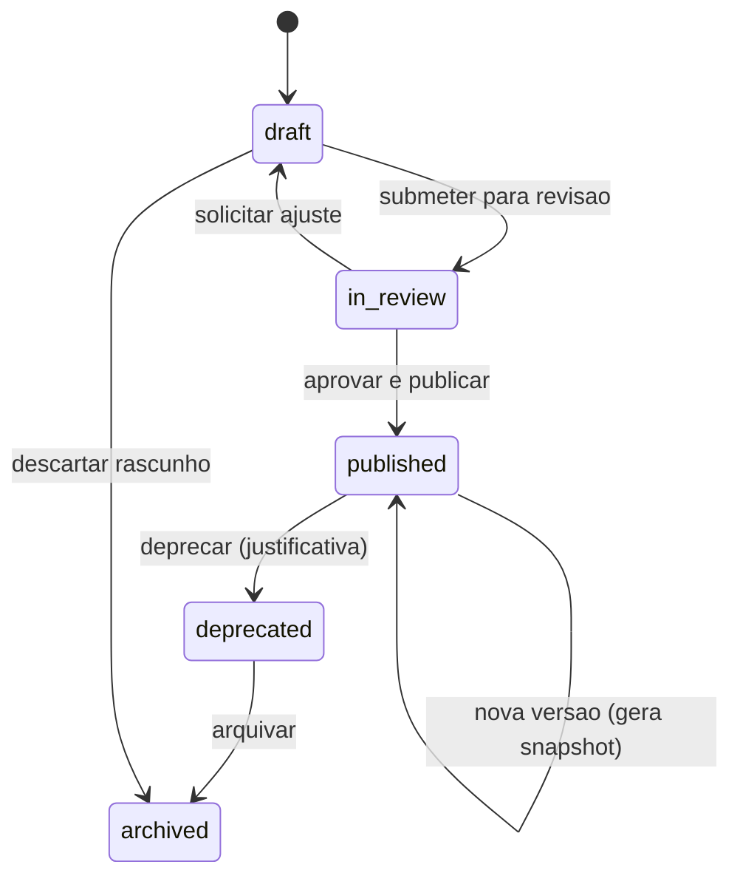

# 02 — Governanca e ciclo de vida

Esta especificacao define os estados de cada item da Biblioteca, suas
transicoes, atores autorizados, validacoes obrigatorias e eventos de
auditoria associados.

## Estados

Todos os itens seguem o mesmo ciclo:

| Estado | Significado | Uso permitido em formularios |
|---|---|---|
| `draft` | Rascunho em construcao. | Nao pode ser usado. |
| `in_review` | Revisao por segundo ator antes da publicacao. | Nao pode ser usado. |
| `published` | Versao institucionalmente valida. | Disponivel para vincular em perguntas. |
| `deprecated` | Descontinuado — so permanece onde ja foi usado. | Nao pode ser vinculado a perguntas novas. |
| `archived` | Removido do catalogo ativo. | Nao aparece em buscas. Historico preservado. |

## Matriz de permissoes por acao

| Acao | Administrador | Respondente |
|---|---|---|
| Criar item em `draft` | sim | nao |
| Editar item em `draft` | sim | nao |
| Submeter para `in_review` | sim | nao |
| Revisar e devolver para `draft` | sim (nao o proprio autor) | nao |
| Publicar (`in_review` -> `published`) | sim | nao |
| Criar nova versao a partir de `published` | sim (gera `draft` derivado) | nao |
| Deprecar (`published` -> `deprecated`) | sim | nao |
| Arquivar (`deprecated` -> `archived`) | sim | nao |
| Gerenciar vocabulario de `tags` | sim | nao |

Regra-chave: **aprovacao em duas etapas** para publicacao critica
(recomendacao-base e acao-modelo).

- Etapa 1 — Revisor tecnico (admin designado) valida texto e
  checklist de qualidade.
- Etapa 2 — Aprovador institucional (Administrador) publica.

Eixos e Secoes podem ser publicados diretamente pelo Administrador sem
a etapa do revisor tecnico, desde que o item esteja em `in_review` com
historico registrado.

## Validacoes obrigatorias por transicao

### `draft` -> `in_review`
- Todos os campos obrigatorios preenchidos (por tipo, conforme 01).
- `code` unico dentro do tipo de item.
- Tags pertencem ao vocabulario controlado.
- Recomendacao-base: `texto_base_parametrizavel` nao contem variaveis
  fora de `variaveis_parametro`.
- Acao-modelo: `criterio_conclusao` preenchido.

### `in_review` -> `published`
- Revisor tecnico diferente do autor quando o tipo exigir dupla etapa.
- Checklist de qualidade 100% atendido para recomendacao-base (ver 06).
- `vigente_de` definido (padrao: agora) e, se `vigente_ate` informado,
  maior que `vigente_de`.
- Justificativa obrigatoria registrada no log de auditoria.

### `published` -> `deprecated`
- Justificativa obrigatoria com motivo e previsao de substituicao.
- Se existir recomendacao-base referenciando acoes-modelo a deprecar,
  o sistema deve bloquear salvo se houver substituto indicado.
- Formularios publicados que usam a versao permanecem validos — a
  depreciacao nao afeta snapshots ja emitidos.

### `deprecated` -> `archived`
- Decorrido prazo minimo definido no painel administrativo.
- Sem referencias ativas em rascunhos de formulario.

### `draft` -> `archived`
- Permitido apenas para rascunhos nunca publicados.

## Eventos de auditoria por transicao

Cada transicao gera um evento com os seguintes campos minimos:

- `event_type` — `library.item.transition`.
- `item_type` — `axis | section | metric | recommendation | action`.
- `item_id`, `item_code`.
- `from_status`, `to_status`.
- `from_version`, `to_version`.
- `actor_user_id`, `actor_role`.
- `justification` — obrigatoria em publicacao, depreciacao e rejeicoes.
- `diff_fields` — lista dos campos alterados quando aplicavel.
- `created_at`.

Politica de retencao: logs da Biblioteca seguem a politica geral da
plataforma, sem expurgo antes do fim do ciclo oficial do formulario
que referencia o item.

## Excecoes institucionais

Um orgao pode registrar, durante o preenchimento, uma **excecao formal**
a uma recomendacao-base disparada automaticamente, informando:

- motivo textual,
- prazo da excecao,
- aprovador institucional,
- anexos/justificativa documental.

Efeitos:

- a recomendacao permanece registrada no portfolio como `em_excecao`
  enquanto o prazo estiver vigente;
- nao afeta calculo FAMI daquela questao — FAMI segue o status da
  evidencia;
- ao vencer o prazo, a recomendacao volta automaticamente para o
  fluxo normal de acompanhamento.

A excecao vive no dominio operacional, nao na Biblioteca — mas esta
referenciada aqui porque e gatilho de governanca cruzada.

## Regras de integridade

- Nao e possivel publicar um item que dependa de outro em estado menor
  que `published` (ex.: Secao exige Eixo publicado; Acao-modelo vinculada
  a Recomendacao exige Recomendacao publicada).
- Ao deprecar um item-pai, itens-filhos publicados continuam validos,
  mas o painel administrativo sinaliza depencia pendente de decisao.
