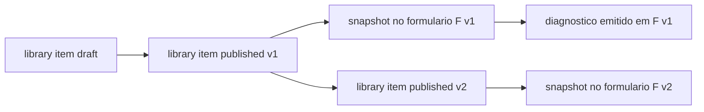

# 03 — Versionamento e compatibilidade

Define como a Biblioteca evolui sem quebrar formularios, diagnosticos e
relatorios ja emitidos, e como qualquer diagnostico pode ser
reconstituido integralmente a qualquer tempo.

## Versionamento semantico por item

Formato: `major.minor.patch`.

| Alteracao | Nivel |
|---|---|
| Mudanca que altera semantica de uso, pontuacao ou regra de disparo. | `major` |
| Ampliacao nao quebra-compatibilidade (campos novos opcionais, acao-modelo extra). | `minor` |
| Ajuste textual/ortografico, correcao de fundamento sem impacto funcional. | `patch` |

Regras:

- `major` novo sempre reinicia `minor` e `patch`.
- `code` e imutavel apos o primeiro `published`. Mudancas de `major`
  mantem o `code` e avancam apenas a versao.
- Publicacao sempre cria uma linha nova em `library_item_versions`
  (historico imutavel).

## Tabela de historico `library_item_versions`

| Campo | Descricao |
|---|---|
| `id` | uuid da versao (distinto do `item_id`). |
| `item_type` | `axis | section | metric | recommendation | action`. |
| `item_id` | referencia ao item logico. |
| `version`, `version_major`, `version_minor`, `version_patch` | versao semantica. |
| `payload` | snapshot completo dos campos do item naquela versao (json). |
| `vigente_de`, `vigente_ate` | janela de vigencia normativa. |
| `published_by`, `published_at` | quem e quando publicou. |
| `deprecated_by`, `deprecated_at` | opcional. |
| `previous_version_id` | ligacao com versao anterior do mesmo item. |
| `hash` | hash determinístico do payload para conferencia. |

Invariantes:

- `payload` e imutavel depois de gravado.
- Nao e permitido remover versoes publicadas.
- Consultas historicas sempre vao em `library_item_versions`; consultas
  de catalogo ativo continuam indo em `library_*`.

## Snapshot no formulario publicado

Quando o Administrador publica um formulario, a plataforma grava, para
cada pergunta do formulario, um **snapshot congelado** dos itens da
Biblioteca usados pelos vinculos.

Entidade sugerida: `form_question_library_snapshot`.

| Campo | Descricao |
|---|---|
| `id` | uuid. |
| `form_version_id` | versao do formulario publicado. |
| `question_id` | pergunta do formulario. |
| `axis_version_id` | referencia em `library_item_versions`. |
| `section_version_id` | idem. |
| `metric_version_id` | idem. |
| `recommendation_version_ids` | array com as recomendacoes-base vinculadas. |
| `action_version_ids` | array com as acoes-modelo vinculadas. |
| `bindings` | mapa cenario -> { recommendation_version_id, priority, action_version_ids }. |
| `captured_at` | data da captura. |
| `hash` | hash do snapshot para conferencia. |

Invariantes:

- O snapshot e imutavel pela vida do formulario publicado.
- Reprocessamento de respostas usa **sempre** o snapshot do formulario
  em que a resposta foi registrada.
- Mesmo se a Biblioteca evoluir, formularios antigos nao sao
  reescritos.

## Ciclo entre versao do item e versao do formulario

Principios:

- Um item pode estar vigente em varias versoes do mesmo formulario.
- Cada versao de formulario guarda o mapeamento exato dos itens que a
  compoem.
- Reabertura administrativa de um formulario encerrado gera uma nova
  versao de processamento, mas **mantem** o snapshot original salvo se
  houver decisao formal para atualizar.

## Politica de vigencia

- Item em vigencia pode ser usado em novos formularios.
- Item com `vigente_ate` no passado nao pode ser vinculado a perguntas
  em formularios em construcao.
- Item ja vinculado em formulario publicado continua produzindo
  recomendacoes ate que o formulario seja encerrado.

## Regressao de regras

Cada mudanca de versao `major` de recomendacao ou metrica deve passar
pelo pacote de casos de teste oficiais em
[08-criterios-aceite.md](08-criterios-aceite.md), garantindo que
resultados historicos continuam reconstrutiveis.

## Deduplicacao e conflito

Quando duas regras de disparo diferentes produzirem recomendacoes
equivalentes em uma mesma resposta, o motor aplica:

1. escolhe a recomendacao de maior prioridade; em empate,
2. escolhe a recomendacao com `version` mais recente publicada no
   snapshot; em empate,
3. unifica por `code` — o portfolio registra apenas uma entrada com
   trilha de origem multipla.

Esse comportamento e o mesmo em reprocessamentos, garantindo
idempotencia.

## Reconstituicao de diagnostico

Com as tabelas acima, dado um diagnostico emitido em data X, o sistema
consegue reconstruir exatamente:

- qual versao de cada item da Biblioteca estava vigente;
- qual snapshot o formulario carregava;
- qual versao do motor aplicou a regra;
- qual recomendacao e acao-modelo foram geradas.

Essa capacidade e obrigatoria para prestacao de contas e auditoria
externa.
